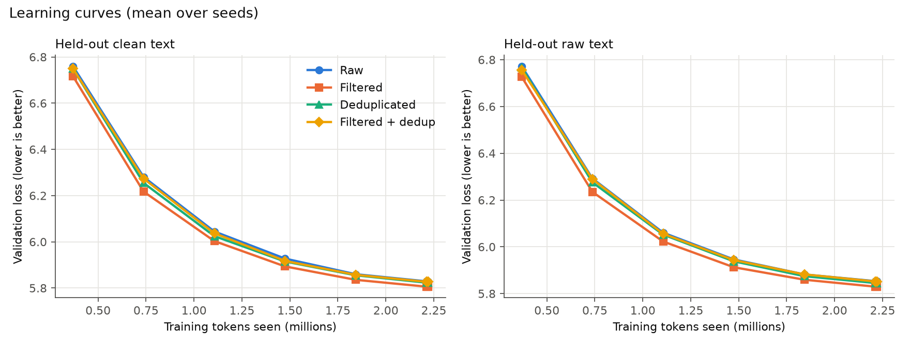

# LLM Data Forge

**Distributed Data Curation and Quality Optimization for Efficient LLM Pretraining**
CSCI 6996 Independent Study

## Overview

Massive training datasets are required for large language models, but these datasets frequently include inconsistent data sources, redundant text, duplicate content, low-quality data, and boilerplate. Processing and training on redundant or poor-quality data increases storage, preprocessing, and compute expenses.

**LLM Data Forge** builds a distributed Big Data pipeline for collecting, processing, filtering, deduplicating, and constructing LLM training datasets, using Apache Spark, Parquet, hashing, MinHash, and Locality-Sensitive Hashing (LSH) to produce multiple curated versions of a training corpus. A small language model is then pretrained on each version to study the effect of data composition, deduplication, and quality on training efficiency and model performance.

## Problem Statement

Large Language Models require large volumes of training data, but these datasets often contain duplicate, repetitive, noisy, or low-quality content. Processing unnecessary data increases storage, processing time, and computational cost. This project addresses the challenge of identifying and improving the quality of LLM training data using scalable distributed data-processing techniques.

## Objective

Develop a distributed data-curation pipeline that filters, deduplicates, and organizes large-scale LLM training data, and evaluate the impact of these techniques on training efficiency and model performance.

## End Goal

Determine whether better-curated training data can reduce data and computational requirements while maintaining or improving LLM performance, providing practical insights into more efficient LLM training.

## Status and Key Results

All five phases are complete. The pipeline was built and run end to end on 20,000 documents of the C4 web corpus (English), producing four dataset variants. The same small GPT-style model (2.6M parameters) was then trained on each variant, with the same token budget (2.22M tokens per run), two random seeds per variant, on a laptop CPU, and tested on identical held-out text.

| Variant | Documents | Tokens | Held-out loss, clean text (perplexity) | Held-out loss, raw text (perplexity) |
|---|---|---|---|---|
| Raw | 19,000 | 12.10M | 5.841 (344.0) | 5.861 (351.2) |
| Filtered | 17,728 | 11.82M | 5.820 (336.9) | 5.837 (342.6) |
| Deduplicated | 18,984 | 12.10M | 5.834 (341.8) | 5.855 (348.8) |
| Filtered + deduplicated | 17,712 | 11.82M | 5.840 (343.6) | 5.858 (350.1) |

Document counts exclude 1,000 documents held out for testing. Losses are means over two seeds; lower is better.



**What we found**

- Quality filtering removed 6.5% of documents (about 2.3% of the tokens) and gave slightly better models: about 2% lower perplexity than raw, better in both seeds and on both test sets.
- Deduplication found 0 exact duplicates and only 16 near-duplicates (0.08%), because C4 is already deduplicated upstream, so it made no measurable difference.
- The combined variant matched raw on average, but its two seeds disagreed.
- No difference was larger than the run-to-run noise (0.058 loss between seeds), so the filtering benefit is suggestive, not proven.

**Limitations:** a very small model trained briefly (under one pass over the data), only two seeds, one pre-cleaned corpus, and no downstream benchmarks. Deduplication was demonstrated at 20,000 documents; an attempt at 100,000 ran out of memory in the MinHash/LSH step. See the [Final Project Report](reports/Final_Project_Report.docx) for details.

## Project Phases

| Phase | Name | Code | Report |
|---|---|---|---|
| 1 | Data Acquisition & Infrastructure Setup | [`src/phase1_ingestion`](src/phase1_ingestion) | [Phase 1 Report](reports/Phase1_Report.docx) |
| 2 | Cleaning & Quality Filtering Pipeline | [`src/phase2_cleaning_filtering`](src/phase2_cleaning_filtering) | [Phase 2 Report](reports/Phase2_Report.docx) |
| 3 | Deduplication Pipeline (Hashing / MinHash / LSH) | [`src/phase3_deduplication`](src/phase3_deduplication) | [Phase 3 Report](reports/Phase3_Report.docx) |
| 4 | Model Pretraining & Experimentation | [`src/phase4_pretraining`](src/phase4_pretraining) | [Phase 4 Report](reports/Phase4_Report.docx) |
| 5 | Evaluation & Analysis | [`src/phase5_evaluation`](src/phase5_evaluation) | [Phase 5 Report](reports/Phase5_Report.docx) |
| — | **Final Project Report** | — | [Final Project Report](reports/Final_Project_Report.docx) |

Each `src/phaseN_*` folder has its own README with that phase's objective, files and how to run it. Each report in `reports/` documents what was built, the results, and the challenges for that phase (see [`docs/Project_Proposal.pdf`](docs/Project_Proposal.pdf) for the original proposal).

## Repository Structure

```
LLM_Data_Forge/
├── docs/                 # Original proposal and reference material
├── reports/              # Phase 1-5 reports + final project report (.docx)
├── results/              # Small JSON/Markdown results and charts (committed)
│   ├── pilot_20k/        #   20,000-document pilot: stats, filtering, dedup
│   ├── scale_100k/       #   100,000-document scale test (ingest + filtering)
│   ├── phase4/           #   training logs for the 8 runs
│   └── phase5/           #   evaluation, comparison table, figures
├── src/
│   ├── phase1_ingestion/
│   ├── phase2_cleaning_filtering/
│   ├── phase3_deduplication/
│   ├── phase4_pretraining/
│   └── phase5_evaluation/
├── data/                 # Local data (gitignored - see data/README.md)
├── notebooks/            # Exploratory notebooks
├── requirements.txt
└── .gitignore
```

Datasets, tokenized files and model checkpoints are kept local and are not committed (see `.gitignore`).

## Getting Started (PyCharm, Windows)

1. Open the project folder in PyCharm and create a Python environment for it.
2. Install dependencies: `pip install -r requirements.txt`.
3. Spark needs a JDK (17 recommended). On Windows it also needs `winutils.exe` and `hadoop.dll` in `C:\hadoop\bin`; `src/phase1_ingestion/spark_session.py` detects Java and Hadoop automatically.
4. Right-click `src/` → **Mark Directory as** → **Sources Root** so imports across phase folders resolve.
5. `.idea/` is gitignored, so local PyCharm settings are not committed.

## How to Reproduce

Run from the project root. Each phase's README lists all options.

```
# Phase 1: stream 20,000 documents from C4 into data/raw (Parquet)
python src/phase1_ingestion/ingest.py --num-docs 20000

# Phase 2: baseline statistics, then quality filtering -> data/filtered
python src/phase2_cleaning_filtering/run_filtering.py

# Phase 3: exact + near-duplicate removal -> data/deduplicated, data/filtered_deduplicated
python src/phase3_deduplication/run_dedup.py

# Phase 4: held-out sets + shared tokenizer, then train 4 variants x 2 seeds (~5 min each on a laptop CPU)
python src/phase4_pretraining/tokenize_dataset.py
python src/phase4_pretraining/run_experiments.py --minutes 5 --seeds 1 2

# Phase 5: evaluate all models and compare the variants
python src/phase5_evaluation/evaluate.py
python src/phase5_evaluation/compare_results.py
```

## Tech Stack

- **Distributed processing:** Apache Spark (PySpark), Parquet (Snappy), pyarrow
- **Source data:** C4 (`allenai/c4`, English) streamed with HuggingFace `datasets`
- **Deduplication:** exact hashing (SHA-256) and MinHash / Locality-Sensitive Hashing (Spark ML)
- **Modeling:** PyTorch (CPU), HuggingFace `tokenizers` (byte-level BPE)
- **Analysis:** NumPy, matplotlib; results saved as JSON

## Workflow / How This Repo Is Used

The project was documented as it progressed: code for each phase was committed to that phase's `src/` folder, and each phase's report in `reports/` was filled in when the phase was completed. After Phase 5 the Final Project Report answered whether the project's objective was achieved.

## References

1. L. Gao et al., "The Pile: An 800GB Dataset of Diverse Text for Language Modeling," arXiv:2101.00027, 2020.
2. K. Lee et al., "Deduplicating Training Data Makes Language Models Better," arXiv:2107.06499, 2022.
3. G. Penedo et al., "The Refined Web Dataset for Falcon LLMs," 2023.
4. G. Penedo et al., "The Fine Web Datasets: Decanting the Web for the Finest Text Data at Scale," NeurIPS, 2024.
5. J. Kaplan et al., "Scaling Laws for Neural Language Models," arXiv:2001.08361, 2020.
6. J. Hoffmann et al., "Training Compute-Optimal Large Language Models," arXiv:2203.15556, 2022.
7. S. Y. Gadre et al., "DataComp: In Search of the Next Generation of Multimodal Datasets," arXiv:2304.14108, 2023.